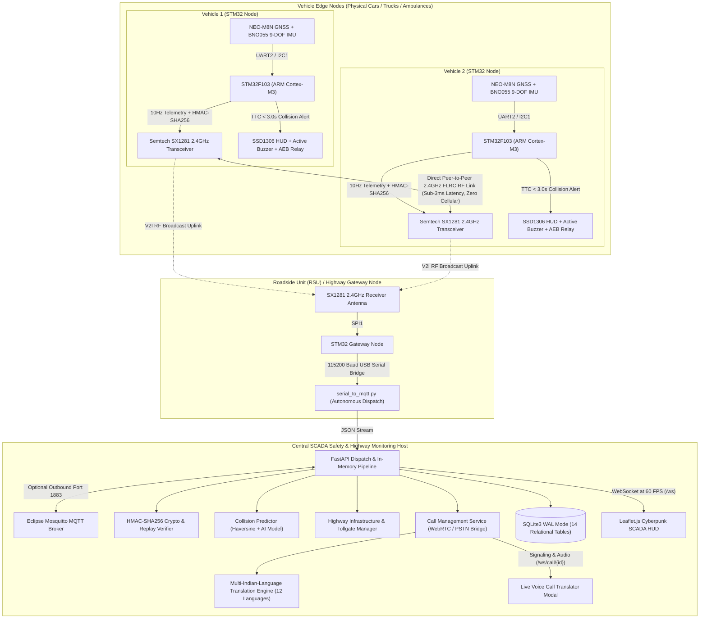
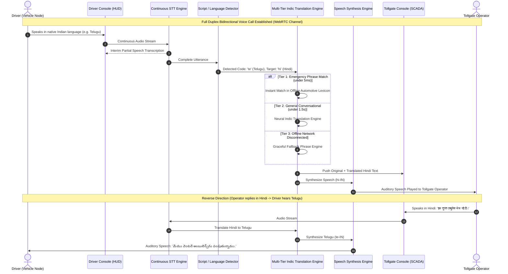

# 🚗⚡ V2V-SCADA: Internet-Independent Vehicle-to-Vehicle Safety & Highway Telemetry System
### Final-Year Engineering Prototype • STM32 ARM Cortex-M Ecosystem • Aligned with MoRTH AIS-230 Concepts • Modular Indic Voice Dispatch

<div align="center">

[](https://github.com/rajeshmediboina596-droid/V2V-SCADA)
[](LICENSE)
[](#5-hardware-wiring-pin-assignment-table)
[](#12-morth-ais-230-regulatory-alignment-standards-context)
[](#8-real-time-multi-indian-language-voice-call-translator-module)
[](#6-software-stack-dependencies)
[](#11-cyber-security-anti-replay-cryptographic-engine)
[-success.svg?style=for-the-badge)](#17-testing-benchmarking-verification)
[](.github/workflows/ci.yml)
[](docs/CANONICAL_TELEMETRY_CONTRACT.md)

<p align="center">
  <b>An academic engineering prototype demonstrating cellular-independent Vehicle-to-Vehicle (V2V) cooperative collision avoidance, emergency voice dispatch, and intelligent highway SCADA telemetry monitoring.</b>
</p>

[ 🚀 Quickstart ](#16-installation-step-by-step-execution-guide) •
[ 🏗️ Architecture ](#3-end-to-end-system-architecture) •
[ 📋 Requirements Matrix ](docs/REQUIREMENTS_MATRIX.md) •
[ 📜 Telemetry Contract ](docs/CANONICAL_TELEMETRY_CONTRACT.md) •
[ 🔌 Pinout & Hardware ](#5-hardware-wiring-pin-assignment-table) •
[ 🛡️ Cybersecurity ](#11-cyber-security-anti-replay-cryptographic-engine) •
[ 🧪 Test Suite (78 Tests) ](#17-testing-benchmarking-verification) •
[ 🔬 Hardware Plan ](docs/HARDWARE_VALIDATION_PLAN.md) •
[ ⚠️ Limitations ](#18-prototype-limitations-engineering-caveats)

</div>

---

## ⚡ System At A Glance

Every claim and technical metric in this repository is explicitly tagged to indicate its engineering verification status:
`[IMPLEMENTED]` (functional in repository code) • `[SIMULATED]` (evaluated via software testbed) • `[DESIGNED]` (architected link specification) • `[TARGET]` (design goal requiring physical RF measurement).

| Metric / Capability | Engineering Status | Specification | Architectural Note |
|:---|:---:|:---|:---|
| **Core Safety Autonomy** | **`[IMPLEMENTED]`** | **100% Cellular & SIM-Card Free** | Core telemetry, collision calculation, and local alerts operate peer-to-peer without cellular/cloud dependence. |
| **RF Wireless Protocol** | **`[DESIGNED]`** | **Semtech SX1280/SX1281 (2.4 GHz)** | High-speed 1.3 Mbps FLRC mode; expected 1–2 km line-of-sight design range (requires open-field validation). |
| **RF Latency Target** | **`[TARGET]`** | **`< 3.0 ms` design target** | Calculated PHY transmission target; end-to-end latency requires oscilloscope/logic analyzer measurement. |
| **Microcontroller Core** | **`[IMPLEMENTED]`** | **STM32 ARM Cortex-M (F103 Blue Pill)** | Deterministic C++ firmware, hardware SPI, dual USART, hardware I2C, and watchdog timer. |
| **Telemetry Update Rate** | **`[IMPLEMENTED]`** | **`10 Hz` (Every 100 ms)** | Broadcast cadence aligned with MoRTH AIS-230 architectural recommendations. |
| **Collision Threat Physics** | **`[IMPLEMENTED]`** | **Haversine + Relative Motion + TTC** | Computes 2D line-of-sight closing velocity and triggers multi-tier warnings (TTC $\le 5.0\text{s}$, $3.5\text{s}$, $2.5\text{s}$). |
| **AEB Braking Indicator** | **`[IMPLEMENTED]`** | **Demonstration Relay Trigger at TTC $\le$ 2.5s** | **Laboratory simulation only**. Relay acts as visual/bench actuator indicator; not connected to actual vehicle brakes. |
| **Cryptographic Security** | **`[IMPLEMENTED]`** | **HMAC-SHA256 + 30s Anti-Replay + Monotonic Seq** | Rejects rogue packets, tampered GPS/speed data, expired timestamps, and sequence regressions. |
| **Collision Risk AI** | **`[SIMULATED]`** | **Scikit-Learn Classifier (Accuracy: 99.6%)** | Prototype model trained on synthetic kinematic TTC data with automatic rule-based fallback. |
| **Emergency Voice Dispatch** | **`[IMPLEMENTED]`** | **12 Indian Languages (WebRTC / Browser API)** | In-browser speech recognition and synthesis with offline Indic emergency lexicon dictionary. |
| **SCADA Host Workstation** | **`[IMPLEMENTED]`** | **FastAPI + WebSockets (60 FPS) + SQLite WAL** | Ingests live telemetry, streams to cybernetic Leaflet dashboard, and generates PDF incident audits. |

---

## Table of Contents
1. [Executive Summary & Abstract](#1-executive-summary-abstract)
2. [Problem Statement & Engineered Architecture](#2-problem-statement-engineered-architecture)
3. [End-to-End System Architecture](#3-end-to-end-system-architecture)
4. [Hardware Requirements & Bill of Materials (BOM)](#4-hardware-requirements-bill-of-materials-bom)
5. [Hardware Wiring & Pin Assignment Table](#5-hardware-wiring-pin-assignment-table)
6. [Software Stack & Dependencies](#6-software-stack-dependencies)
7. [Mathematical & Algorithmic Formulation](#7-mathematical-algorithmic-formulation)
8. [Real-Time Multi-Indian-Language Voice Call Translator Module](#8-real-time-multi-indian-language-voice-call-translator-module)
9. [Highway Infrastructure (V2I) & Tollgate Awareness Module](#9-highway-infrastructure-v2i-tollgate-awareness-module)
10. [Canonical Telemetry Contract & AIS-230 Specification](#10-canonical-telemetry-contract-ais-230-specification)
11. [Cyber-Security & Anti-Replay Cryptographic Engine](#11-cyber-security-anti-replay-cryptographic-engine)
12. [MoRTH AIS-230 Regulatory Alignment & Standards Context](#12-morth-ais-230-regulatory-alignment-standards-context)
13. [Database Architecture (SQLite WAL Mode)](#13-database-architecture-sqlite-wal-mode)
14. [REST API & WebSocket Protocol Reference](#14-rest-api-websocket-protocol-reference)
15. [Repository Directory Structure](#15-repository-directory-structure)
16. [Installation & Step-by-Step Execution Guide](#16-installation-step-by-step-execution-guide)
17. [Testing, Benchmarking & Verification](#17-testing-benchmarking-verification)
18. [Prototype Limitations & Engineering Caveats](#18-prototype-limitations-engineering-caveats)
19. [Troubleshooting & Gotchas](#19-troubleshooting-gotchas)
20. [License & Attribution](#20-license-attribution)

---

## 1. Executive Summary & Abstract


Road traffic collisions remain a primary cause of severe trauma on Indian national and state highways. A disproportionate number of fatal multi-vehicle crashes occur under **Non-Line-of-Sight (NLOS)** conditions—including blind mountain curves, monsoon downpours, dust storms, and oversized freight convoys obstructing optical visibility. Conventional optical cameras, LiDAR, and radar are incapable of looking around physical obstacles or through heavy transport vehicles. Furthermore, commercial connected vehicle (C-V2X) architectures that rely on 4G/5G cellular towers fail in rural ghat sections, mountain tunnels, and network blind spots.

Recognizing these challenges, the **Ministry of Road Transport and Highways (MoRTH), Government of India**, introduced the **AIS-230** framework to explore dedicated direct Vehicle-to-Vehicle (V2V) safety communications.

This project implements an end-to-end **V2V Communication and Supervisory Control and Data Acquisition (SCADA) Safety Monitoring System** developed as a final-year engineering prototype and research testbed. The system combines:
1. **Physical Edge Nodes**: STM32 ARM Cortex-M microcontrollers paired with Semtech SX1281 2.4 GHz transceivers, GNSS positioning, and IMU orientation sensors.
2. **Cryptographic Integrity**: Canonical HMAC-SHA256 packet signing and anti-replay windowing to reject rogue injection and spoofed telemetry.
3. **Deterministic Collision Mathematics**: Geodesic Haversine separation and Cartesian relative closing velocity calculations yielding Time-to-Collision (TTC) alerts.
4. **Supervisory SCADA Workstation**: High-frequency FastAPI web backend with 60 FPS WebSocket streaming, interactive Leaflet geospatial HUD, and automated PDF audit generation.
5. **Modular Multilingual Dispatch**: WebRTC and browser-based speech translation covering 12 Indian languages for roadside incident coordination.

---

## 2. Problem Statement & Engineered Architecture

```
┌────────────────────────────────────────────────────────────────────────────────────────┐
│               CORE SAFETY PATH (100% Offline / Zero Cellular or Cloud Dependency)       │
│                                                                                        │
│   STM32 Microcontroller Edge Node (Blue Pill ARM Cortex-M)                             │
│   └── Ingests U-blox GNSS (10Hz) & IMU Orientation Dynamics                           │
│   └── Generates Canonical HMAC-SHA256 Cryptographic Signature                          │
│   └── Broadcasts 2.4 GHz RF Packets via Semtech SX1281 (FLRC mode)                     │
│         ▼                                                                              │
│   Peer Vehicles Receive Packet Directly via 2.4 GHz RF Antenna                         │
│   └── Verifies Cryptographic Signature & Monotonic Sequence Number                     │
│   └── Computes Geodesic Distance (Haversine) & Relative Closing Velocity               │
│   └── Calculates Time-to-Collision (TTC) & Threat Level (Safe/Advisory/Warning/Critical)│
│   └── Actuates In-Cabin OLED HUD, Buzzer, and AEB Demonstration Relay                   │
│   └── (Optional) Uplinks to Roadside Unit (RSU) Gateway via USB Serial for SCADA       │
└────────────────────────────────────────────────────────────────────────────────────────┘
                                            │ (Optional Serial / USB Bridge)
┌────────────────────────────────────────────────────────────────────────────────────────┐
│            OPTIONAL COMMUNICATION PATH (Browser / Configured External Providers)       │
│                                                                                        │
│   SCADA Browser Console / In-Cabin Web Interface                                       │
│   └── Full-Duplex Audio & WebRTC Signaling (WebRTCTelephonyProvider)                   │
│   └── Speech-to-Text Recognition (Web Speech API / Optional Cloud ASR)                 │
│   └── Multi-Indian-Language Translation Engine (Tier-1 Indic Lexicon + Neural Bridge)  │
│   └── Text-to-Speech Synthesis (Browser Speech Synthesis / Optional Neural TTS)        │
│   └── Privacy-Confirmed Emergency Telemetry Dossier Sharing to Tollgate Console        │
│   *Note: Optional voice features depend on configured browser APIs or network services*│
└────────────────────────────────────────────────────────────────────────────────────────┘
```


---

## 3. End-to-End System Architecture



---

## 4. Hardware Requirements & Bill of Materials (BOM)

To build a **2-Vehicle + 1-Gateway Testbed**, three physical STM32 microcontroller nodes are required:
- **Vehicle Node 1**: Edge vehicle node mounted on Car/Truck 1.
- **Vehicle Node 2**: Edge vehicle node mounted on Car/Truck 2 (or Emergency Ambulance).
- **Gateway Node**: Stationary Roadside Unit (RSU) connected to the SCADA monitoring station via USB.

### Detailed Shopping List & Component Specifications

| # | Component | Model / Specification | Purpose & Functionality | Qty |
|:---:|:---|:---|:---|:---:|
| **1** | **Main Microcontroller** | **STM32F103C8T6 (Blue Pill)** *(or STM32F411CEU6 Black Pill)* | 32-bit ARM Cortex-M3 (72 MHz), 64KB Flash, 20KB SRAM, hardware SPI, 2x USART, 2x I2C. Handles 10Hz GPS parsing, IMU sensor fusion, HMAC-SHA256 signing, and edge collision mathematics. | **3 pcs** |
| **2** | **V2V RF Transceiver** | **Semtech SX1280 / SX1281 (2.4 GHz)** | High-speed 2.4 GHz FLRC mode (up to 1.3 Mbps) and LoRa. Delivers **< 3ms latency**, 1–2 km range, zero cellular dependency, and hardware CRC. | **3 pcs** |
| **3** | **2.4 GHz Antenna** | **IPEX to SMA Female + 2.4GHz 3dBi Rubber Duck Antenna** | Maximizes RF range and impedance matching for vehicular testing. | **3 pcs** |
| **4** | **GNSS / GPS Receiver** | **U-blox NEO-M8N** *(or NEO-6M)* with Ceramic Patch Antenna | Multi-constellation (GPS, GLONASS, Galileo) satellite positioning with up to **10Hz navigation update rate**, providing Latitude, Longitude, Altitude, and Ground Speed. | **2 pcs** |
| **5** | **Absolute Orientation (IMU)** | **Bosch BNO055 9-DOF** *(or InvenSense MPU-6050 6-DOF)* | Provides 3-axis acceleration, 3-axis gyroscopic rates, and 3-axis magnetic compass. BNO055 features on-chip sensor fusion outputting absolute **Heading/Yaw (0–360°), Pitch (road grade), and Roll (tilt/rollover risk)**. | **2 pcs** |
| **6** | **Cockpit HUD Display** | **0.96" or 1.3" I2C OLED (SSD1306 / SH1106, 128x64)** | High-contrast in-cabin screen displaying live speed, heading, nearest vehicle ID, distance, and collision hazard warnings. | **2 pcs** |
| **7** | **Acoustic Warning Alarm** | **5V Active Piezo Buzzer Module** | Emits a high-decibel audible alarm when Time-to-Collision (TTC) drops below 3.0 seconds. | **2 pcs** |
| **8** | **Hazard Warning LEDs** | **5mm LEDs (Red, Yellow, Green) + 220Ω Resistors** | Multi-tiered visual indicators for Safe (Green), Caution (Yellow), and Imminent Collision (Red). | **2 sets** |
| **9** | **AEB Braking Simulator** | **5V 1-Channel Relay Module (Optocoupler-Isolated)** | Simulates Automatic Emergency Braking (AEB) solenoid activation or emergency hazard lights. | **2 pcs** |
| **10** | **Automotive Buck Converter** | **LM2596 or MP1584EN Step-Down Module** | Converts car 12V/24V electrical bus down to clean 5V DC (3A max). | **2 pcs** |
| **11** | **Dedicated 3.3V LDO Rail** | **AMS1117-3.3V Voltage Regulator Board (800mA–1A)** | **CRITICAL**: The Blue Pill onboard regulator supplies only ~100mA. The SX1281 draws up to 120mA during TX. This dedicated rail powers the radio and sensors, eliminating brownout resets. | **3 pcs** |
| **12** | **USB-to-UART Serial Bridge** | **CP2102 or FT232RL USB-to-UART Module** | **Dual Purpose**: (1) Flashes STM32 firmware via built-in ROM bootloader (BOOT0=1 on USART1 PA9/PA10) with **zero ST-Link required**; (2) Bridges the Gateway RSU to the SCADA laptop at 115200 baud. | **1 pc** |
| **13** | **Field Battery Supply** | **18650 3.7V Li-ion Cells (2500mAh) + TP4056 USB-C Charger** | Enables portable bench and vehicle field testing. | **2 sets** |
| **14** | **Prototyping & Wiring** | **Breadboards, Dupont Cables, 4.7kΩ I2C Pullups, 100µF Caps** | Bus wiring, signal integrity decoupling, and breadboard setup. | **1 kit** |

---

## 5. Hardware Wiring & Pin Assignment Table

The table below details all hardware pin assignments for the **STM32F103C8T6 (Blue Pill)**:

```
                      +-------------------+
                      |   STM32F103C8T6   |
                      |    (BLUE PILL)    |
                      +-------------------+
  (Backup Battery) -| VBAT           3.3V |- (VCC 3.3V Out)
   (Onboard LED)   -| PC13           GND  |- (Ground)
  (OSC32 In 32kHz) -| PC14           5V   |- (5V In / USB Power)
  (OSC32 Out 32kHz)-| PC15           PB9  |- (AEB Relay Trigger)
      (ADC / Free) -| PA0            PB8  |- (Piezo Buzzer Alarm)
  (Status LED Grn) -| PA1            PB7  |- (I2C1 SDA - BNO055/OLED)
  (NEO-M8N GPS TX) -| PA2            PB6  |- (I2C1 SCL - BNO055/OLED)
  (NEO-M8N GPS RX) -| PA3            PB5  |- (Free GPIO)
       (SX1281 CS) -| PA4            PB4  |- (Free GPIO)
      (SX1281 SCK) -| PA5            PB3  |- (Free GPIO)
     (SX1281 MISO) -| PA6            PA15 |- (Free GPIO)
     (SX1281 MOSI) -| PA7            PA12 |- (USB D+)
     (SX1281 DIO1) -| PB0            PA11 |- (USB D-)
      (SX1281 RST) -| PB1            PA10 |- (CP2102 TX -> USART1 RX)
     (SX1281 BUSY) -| PB10           PA9  |- (CP2102 RX <- USART1 TX)
      (Free GPIO)  -| PB11           PA8  |- (Threat Alert LED Red)
     (NRST Button) -| NRST           PB15 |- (Free GPIO)
       (3.3V Rail) -| 3.3V           PB14 |- (Free GPIO)
          (Ground) -| GND            PB13 |- (Free GPIO)
          (Ground) -| GND            PB12 |- (Free GPIO)
                      +-------------------+
                      | BOOT0: 1=Flash, 0=Run |
                      +-------------------+
```

### Complete Pin Assignment Matrix

| Peripheral Component | Module Pin | STM32 Blue Pill Pin | Logic Voltage | Subsystem Role |
|:---|:---|:---:|:---:|:---|
| **Semtech SX1281 2.4GHz** | **NSS (CS)** | **PA4** | 3.3V | SPI1 Chip Select (Active Low) |
| **Semtech SX1281 2.4GHz** | **SCK** | **PA5** | 3.3V | SPI1 Serial Clock (up to 18 MHz) |
| **Semtech SX1281 2.4GHz** | **MISO** | **PA6** | 3.3V | SPI1 Master In Slave Out |
| **Semtech SX1281 2.4GHz** | **MOSI** | **PA7** | 3.3V | SPI1 Master Out Slave In |
| **Semtech SX1281 2.4GHz** | **DIO1** | **PB0** | 3.3V | Packet RX Done / TX Complete Interrupt |
| **Semtech SX1281 2.4GHz** | **RST** | **PB1** | 3.3V | Hardware Radio Reset |
| **Semtech SX1281 2.4GHz** | **BUSY** | **PB10** | 3.3V | Radio State Machine Busy Flag |
| **Semtech SX1281 2.4GHz** | **VCC / GND** | **Ext 3.3V / GND** | 3.3V | Powered via dedicated AMS1117-3.3V (800mA) |
| **U-blox NEO-M8N / 6M** | **TX** | **PA3** | 3.3V | USART2 RX (NMEA Sentence Stream @ 9600/38400) |
| **U-blox NEO-M8N / 6M** | **RX** | **PA2** | 3.3V | USART2 TX (UBX Configuration Commands) |
| **U-blox NEO-M8N / 6M** | **VCC / GND** | **5V / GND** | 5V | Regulated 5V Power Rail |
| **Bosch BNO055 / MPU6050** | **SCL** | **PB6** | 3.3V | I2C1 Clock (with 4.7kΩ pullup to 3.3V) |
| **Bosch BNO055 / MPU6050** | **SDA** | **PB7** | 3.3V | I2C1 Data (with 4.7kΩ pullup to 3.3V) |
| **SSD1306 128x64 OLED** | **SCL / SDA** | **PB6 / PB7** | 3.3V | Shared I2C1 Bus (Address `0x3C`) |
| **Active Piezo Buzzer** | **Signal (+)** | **PB8** | 3.3V–5V | Audible Collision Alarm (PWM / Digital High) |
| **AEB Relay Module** | **IN1** | **PB9** | 5V (Opto) | Emergency Braking Solenoid Simulation |
| **Threat Alert LED** | **Anode (+)** | **PA8** | 3.3V (220Ω) | Red Visual Warning Indicator |
| **Network Status LED** | **Anode (+)** | **PA1** | 3.3V (220Ω) | Green RF Heartbeat Pulse |
| **CP2102 Serial Bridge** | **TX / RX** | **PA10 / PA9** | 3.3V | Dual-Role: Built-in Flashing (BOOT0=1) & SCADA Gateway @ 115200 Baud (CP2102 TX ➔ PA10 RX, CP2102 RX  PA9 TX) |
| **Boot Mode Jumpers** | **BOOT0 / BOOT1** | **Onboard Headers** | 3.3V / GND | Set BOOT0=1 to Flash via CP2102, BOOT0=0 to Run |

---

## 6. Software Stack & Dependencies

```
+---------------------------------------------------------------------------------------+
|                                    PRESENTATION LAYER                                 |
|   Vanilla HTML5 | CSS3 (Dark/Light Cyberpunk Glassmorphism) | JavaScript (ES2022)     |
|   Leaflet.js 1.9.4 (Map Engine) | Chart.js 4.4.0 (Speed Dynamics) | Web Audio API     |
+-------------------------------------------+-------------------------------------------+
                                            | WebSockets (ws:// / wss://)
+-------------------------------------------v-------------------------------------------+
|                                   APPLICATION BACKEND LAYER                           |
|   FastAPI 0.104.1 | Starlette | Uvicorn 0.24.0 (ASGI Web Server)                      |
|   Pydantic v2 (Data Validation) | Scikit-Learn 1.3.2 (ML Collision Prediction)        |
|   ReportLab 4.0.7 (PDF Incident Reporting) | PySerial 3.5 (USB RSU Interface)         |
+-------------------------------------------+-------------------------------------------+
                                            |
+-------------------------------------------v-------------------------------------------+
|                          COMMUNICATION & TELEPHONY LAYER                              |
|   WebRTC In-Browser Duplex Channel | Web Speech API (Continuous STT & TTS)            |
|   Provider Abstraction Layer: WebRTC, Twilio, Mock Telephony, Google STT, GTTS        |
|   Multi-Indian-Language Translation Engine (12 Languages + BCP-47 Mapping)            |
|   Eclipse Mosquitto 2.0.18 MQTT Broker (Port 1883 / TLS 8883)                         |
+-------------------------------------------+-------------------------------------------+
                                            |
+-------------------------------------------v-------------------------------------------+
|                                    PERSISTENCE LAYER                                  |
|   SQLite3 with Write-Ahead Logging (WAL Mode) | Asynchronous Queue Batch Writer       |
|   14 Relational Tables: Telemetry, Incidents, Tollgates, Calls, Translations, Audits  |
+-------------------------------------------+-------------------------------------------+
                                            |
+-------------------------------------------v-------------------------------------------+
|                                 EMBEDDED HARDWARE FIRMWARE                            |
|   STM32duino Core | RadioLib 6.4.0 (SX1281 Driver) | TinyGPS++ (NMEA GPS Parser)     |
|   ArduinoCryptographicLibrary (HMAC-SHA256) | Adafruit BNO055 / MPU6050 Driver        |
+---------------------------------------------------------------------------------------+
```

---

## 7. Mathematical & Algorithmic Formulation

### 7.1 Great-Circle Distance (Haversine Formula)
To determine the geographic distance between two moving vehicles $(V_1, V_2)$ across the Earth's spherical surface:

$$\Delta\phi = \phi_2 - \phi_1, \quad \Delta\lambda = \lambda_2 - \lambda_1$$

$$a = \sin^2\left(\frac{\Delta\phi}{2}\right) + \cos(\phi_1)\cos(\phi_2)\sin^2\left(\frac{\Delta\lambda}{2}\right)$$

$$c = 2 \cdot \text{atan2}\left(\sqrt{a}, \sqrt{1-a}\right), \quad d = R \cdot c$$

*Where $R = 6,371,000 \text{ m}$ (mean Earth radius), and $\phi, \lambda$ represent Latitude and Longitude in radians.*

### 7.2 Dynamic Closing Speed ($\Delta v$)
The relative velocity vector between two vehicles moving with speeds $s_1, s_2$ and headings $\theta_1, \theta_2$:

$$v_{1x} = s_1 \cos(\theta_1), \quad v_{1y} = s_1 \sin(\theta_1)$$

$$v_{2x} = s_2 \cos(\theta_2), \quad v_{2y} = s_2 \sin(\theta_2)$$

$$\vec{r}_{rel} = (x_1 - x_2, y_1 - y_2), \quad \vec{v}_{rel} = (v_{1x} - v_{2x}, v_{1y} - v_{2y})$$

$$\text{Closing Speed } v_{close} = - \frac{\vec{r}_{rel} \cdot \vec{v}_{rel}}{\|\vec{r}_{rel}\|}$$

*If $v_{close} \le 0$, the vehicles are diverging or maintaining constant spacing, and the collision risk is zero.*

### 7.3 Time-To-Collision (TTC) & Threat Hierarchy
Time-To-Collision calculates the time window remaining before impact occurs:

$$\text{TTC} = \frac{d}{v_{close}} \quad (\text{for } v_{close} > 0.5 \text{ m/s})$$

| Risk Level | Threat Classification | TTC Threshold | Distance | System Response |
|:---:|:---|:---:|:---:|:---|
| **0** | **SAFE** | $\text{TTC} > 5.0\text{ s}$ | $> 100\text{ m}$ | Normal telemetry streaming; Green indicator. |
| **1** | **ADVISORY** | $3.5\text{ s} < \text{TTC} \le 5.0\text{ s}$ | $50\text{ m} - 100\text{ m}$ | Visual caution on OLED HUD; Yellow indicator. |
| **2** | **WARNING** | $2.5\text{ s} < \text{TTC} \le 3.5\text{ s}$ | $25\text{ m} - 50\text{ m}$ | Rapid audible beeping; Red HUD hazard flash. |
| **3** | **CRITICAL IMMINENT**| $\text{TTC} \le 2.5\text{ s}$ | $< 25\text{ m}$ | Continuous buzzer alarm; **AEB Relay Triggers Braking**. |
| **4** | **EMERGENCY VEHICLE**| N/A | $< 200\text{ m}$ | High-priority ambulance alert: **"Yield Right of Way"**. |

### 7.4 Geofence Containment (Ray-Casting Point-in-Polygon)
Tests whether vehicle coordinate $(x, y)$ falls inside a restricted highway zone polygon vertices $(P_1, \dots, P_n)$:

$$\text{Ray Intersect Condition: } \left(y_i > y\right) \ne \left(y_j > y\right) \land \left(x < \frac{(x_j - x_i)(y - y_i)}{y_j - y_i} + x_i\right)$$

---

## 8. Real-Time Multi-Indian-Language Voice Call Translator Module



### 8.1 12 Supported Indian Languages

The system provides out-of-the-box support for **12 Indian languages** plus an extensible registry:

| Code | Language Name | Native Script Name | BCP-47 Tag | Sample Automotive Emergency Phrase |
|:---:|:---|:---|:---:|:---|
| **`te`** | **Telugu** | **తెలుగు** | `te-IN` | రోడ్డు ప్రమాదం జరిగింది, అత్యవసర సహాయం కావాలి. |
| **`hi`** | **Hindi** | **हिन्दी** | `hi-IN` | सड़क दुर्घटना हुई है, तत्काल आपातकालीन सहायता भेजें। |
| **`ta`** | **Tamil** | **தமிழ்** | `ta-IN` | சாலை விபத்து ஏற்பட்டுள்ளது, உடனடியாக அவசர உதவி அனுப்பவும். |
| **`kn`** | **Kannada** | **ಕನ್ನಡ** | `kn-IN` | ಬ್ರೇಕ್ ವಿಫಲವಾಗಿದೆ! ದಯವಿಟ್ಟು ಇತರ ವಾಹನಗಳು ದಾರಿ ಬಿಡಿ. |
| **`ml`** | **Malayalam** | **മലയാളം** | `ml-IN` | തീപിടുത്തം ഉണ്ടായിരിക്കുന്നു, പെട്ടെന്ന് വണ്ടി നിർത്തണം! |
| **`mr`** | **Marathi** | **मराठी** | `mr-IN` | गाडीचा टायर फुटला आहे, कृपया क्रेन पाठवा. |
| **`bn`** | **Bengali** | **বাংলা** | `bn-IN` | গাড়ির ব্রেক ফেল করেছে, অবিলম্বে অ্যাম্বুলেন্স প্রয়োজন। |
| **`gu`** | **Gujarati** | **ગુજરાતી** | `gu-IN` | કાર અકસ્માત થયો છે, તાત્કાલિક પોલીસ સહાય મોકલો. |
| **`pa`** | **Punjabi** | **ਪੰਜਾਬੀ** | `pa-IN` | ਗੱਡੀ ਖਰਾਬ ਹੋ ਗਈ ਹੈ, ਹਾਈਵੇਅ ਪੈਟਰੋਲ ਭੇਜੋ। |
| **`or`** | **Odia** | **ଓଡ଼ିଆ** | `or-IN` | ଗାଡ଼ିରେ ନିଆଁ ଲାଗିଯାଇଛି, ଶୀଘ୍ର ଦମକଳ ପଠାନ୍ତୁ! |
| **`as`** | **Assamese** | **অসমীয়া** | `as-IN` | পথ দুৰ্ঘটনা হৈছে, অনুগ্ৰহ কৰি চিকিৎসালয়ৰ সহায় পঠিয়াওক। |
| **`en`** | **English** | **English** | `en-IN` | Critical vehicle breakdown near toll plaza milestone. |

### 8.2 Architectural Provider Abstraction Layer (`backend/providers/`)
The voice translator is built on clean provider abstractions, configurable via `.env`:
- **`TelephonyProvider`** ([backend/providers/telephony.py](file:///c:/projectss/v2v%20communication/backend/providers/telephony.py)):
  - `WebRTCTelephonyProvider`: Low-latency, full-duplex in-browser voice channel with WebSocket signaling.
  - `TwilioTelephonyProvider`: Commercial PSTN telephony bridge for routing to conventional landlines/mobiles.
  - `MockTelephonyProvider`: Deterministic offline simulation for bench testing.
- **`SpeechToTextProvider`** ([backend/providers/stt.py](file:///c:/projectss/v2v%20communication/backend/providers/stt.py)):
  - `BrowserWebSpeechSTTProvider`: Continuous browser streaming speech recognition.
  - `GoogleSTTProvider`: Cloud speech-to-text API.
  - `MockSTTProvider`: Offline benchmark provider.
- **`TranslationProvider`** ([backend/providers/translation.py](file:///c:/projectss/v2v%20communication/backend/providers/translation.py)):
  - `MultiIndianTranslationEngine`: High-speed pipeline with Unicode script detection, Tier 1 offline lexicon (instant sub-5ms match), Tier 2 neural Indic translation, and Tier 3 graceful offline fallback.
- **`TextToSpeechProvider`** ([backend/providers/tts.py](file:///c:/projectss/v2v%20communication/backend/providers/tts.py)):
  - `BrowserWebSpeechTTSProvider`: High-fidelity client-side speech synthesis with Indian voice selection.
  - `GTTSProvider`: Cloud neural TTS generator.
  - `MockTTSProvider`: Headless audio synthesis simulator.

### 8.3 Privacy-Preserving Telemetry Dossier Sharing
During an emergency call, drivers can optionally click **"📡 Transmit Telemetry Dossier"**. The system requests explicit driver confirmation via modal confirmation before sending vehicle ID, GPS coordinates, speed, orientation, collision alert status, and highway name to the tollgate operator console.

---

## 9. Highway Infrastructure (V2I) & Tollgate Awareness Module

The platform integrates pre-seeded geospatial models of Indian National Highways:

```
[Vehicle Approaching NH-65 Corridor]
             |
             +---> Distance > 500m : Standby monitoring
             |
             +---> Distance <= 500m : "Tollgate Approach Alert" (Speed advisory & toll rate alert)
             |
             +---> Passing Tollgate : "Tollgate Crossed Notification" + 1-Click "📞 Call Tollgate"
```

### Pre-Seeded Tollgate Facilities
- **TG-HYD-01 (Jubilee Hills Smart Toll Plaza)**: NH-65 Corridor | 17.4270° N, 78.4450° E
- **TG-PUN-02 (Pune Expressway Gateway Plaza)**: Mumbai-Pune Expressway | 18.7500° N, 73.4000° E
- **TG-BLR-03 (Electronic City Elevated Plaza)**: NH-44 South Corridor | 12.8450° N, 77.6600° E
- **TG-VIZ-04 (Vijayawada Bypass Toll Plaza)**: NH-16 East Coast | 16.5100° N, 80.6200° E

---

## 10. Canonical Telemetry Contract & AIS-230 Specification

Every vehicle node broadcasts a 10Hz cryptographic telemetry packet conforming strictly to the unified **[Canonical Telemetry Contract (v1.0)](docs/CANONICAL_TELEMETRY_CONTRACT.md)**:

```json
{
  "vehicle_id": "AP-09-EM-108",
  "vehicle_type": "Emergency",
  "timestamp": 1727352000,
  "seq": 1420,
  "lat": 17.423912,
  "lon": 78.448345,
  "alt": 542.5,
  "speed_kmph": 78.4,
  "heading_deg": 182.5,
  "pitch_deg": 1.2,
  "roll_deg": -0.8,
  "yaw_deg": 182.5,
  "battery_level": 96.5,
  "emergency_status": 1,
  "rf_status": "OK",
  "fault_code": "NONE",
  "signature": "304655f46eb2c64032d8478d1f70a59a722ea05b22b2ee2d80d297ff05b76cf6"
}
```

### Deterministic Canonical Signing Representation
To eliminate serialization ambiguity between C++ microcontrollers (`ArduinoJson` / `SHA256.h`) and Python backends (`hmac` / `hashlib`), signatures are generated over an exact, byte-level delimited string:
```text
vehicle_id={vid}|vehicle_type={vtype}|timestamp={ts}|seq={seq}|lat={lat:.6f}|lon={lon:.6f}|speed_kmph={speed:.1f}|heading_deg={int(round(heading))}
```

### Packet Field Definitions & Physical Bounds

| Field Name | Data Type | Units | Range / Physical Bounds | Description & Validation Rules |
|:---|:---|:---:|:---:|:---|
| `vehicle_id` | `String` | — | 1 to 32 chars (`[A-Za-z0-9_-]+`) | Unique vehicle registration identifier (e.g. `TS-07-EA-1234`). |
| `vehicle_type` | `String` | — | `Passenger`, `Truck`, `Emergency` | Vehicle chassis class. `Emergency` triggers Threat Level 4 preemption. |
| `timestamp` | `Integer` | Seconds | Unix epoch ($> 1700000000$) | Sensor sampling time. Tolerance check enforces $\pm 30\text{s}$ freshness. |
| `seq` | `Integer` | Count | $0 \le \text{seq} \le 2^{32}-1$ | Monotonically increasing sequence number (Anti-replay guard). |
| `lat` | `Float` | Degrees | $-90.000000 \le \phi \le +90.000000$ | WGS-84 Latitude formatted with 6 decimal places ($\sim 0.11\text{m}$ precision). |
| `lon` | `Float` | Degrees | $-180.000000 \le \lambda \le +180.000000$ | WGS-84 Longitude formatted with 6 decimal places ($\sim 0.11\text{m}$ precision). |
| `alt` | `Float` | Meters | $-500.0 \le h \le +10000.0$ | Altitude above mean sea level. |
| `speed_kmph` | `Float` | km/h | $0.0 \le v \le 250.0$ | Ground speed over earth surface (converted to m/s via $/3.6$ for TTC). |
| `heading_deg`| `Float` | Degrees | $0.0^\circ \le \theta < 360.0^\circ$ | Trajectory course over ground ($0^\circ = \text{True North}, 90^\circ = \text{East}$). |
| `pitch_deg` | `Float` | Degrees | $-90.0^\circ \le \alpha \le +90.0^\circ$ | Longitudinal chassis inclination angle (MPU-6050 accelerometer). |
| `roll_deg` | `Float` | Degrees | $-90.0^\circ \le \beta \le +90.0^\circ$ | Lateral chassis rollover/bank angle (MPU-6050 accelerometer). |
| `yaw_deg` | `Float` | Degrees | $0.0^\circ \le \gamma < 360.0^\circ$ | Absolute gyroscopic orientation angle. |
| `battery_level`|`Float` | % | $0.0\% \le \text{SOC} \le 100.0\%$ | DC bus battery state-of-charge. |
| `emergency_status`|`Int`| Binary | $0$ (Normal) or $1$ (Siren Active) | Emergency right-of-way yield flag. |
| `rf_status` | `String` | — | `OK`, `DEGRADED`, `OFFLINE` | RF transceiver self-diagnostic status. |
| `fault_code` | `String` | — | `NONE`, `ERR_IMU_OFFLINE`, etc. | Diagnostic trouble code from edge self-test. |
| `signature` | `String` | Hex | Exactly 64 hex characters | Cryptographic HMAC-SHA256 signature of canonical string. |

---

## 11. Cyber-Security & Anti-Replay Cryptographic Engine

The telemetry ingest pipeline implements deterministic cryptographic verification to protect against unauthorized packet injection, GPS spoofing, and RF replay:

```
[Incoming RF / HTTP Telemetry Packet]
        |
        +---> 1. Timestamp Freshness Check: |time.time() - packet.timestamp| <= 30.0s?
        |            |-- No  --> DROP (TIMESTAMP_EXPIRED)
        |
        +---> 2. Sequence Monotonicity Check: packet.seq > last_seq[vehicle_id]?
        |            |-- (Node reboot check: if seq <= 5 and time advanced, reset sequence)
        |            |-- No  --> DROP (REPLAY_SEQUENCE_DUPLICATE)
        |
        +---> 3. Canonical HMAC-SHA256 Verification:
                     constant_time_compare(hmac(secret_key, canonical_payload), signature)?
                     |-- No  --> DROP & LOG SECURITY AUDIT EVENT (HMAC_SIGNATURE_MISMATCH)
                     |-- Yes --> VALIDATED -> Dispatch to Collision Engine & SCADA HUD
```

### Deep Packet Inspection (DPI) Feed
The SCADA interface includes a real-time Deep Packet Inspection hex viewer. Verified packets display with `[RF_2.4G] CRC:OK | HMAC:VALID | 0xXXXX`. Rogue or tampered packets display with high-contrast warning indicators: `[DROPPED] HMAC_SIGNATURE_MISMATCH | REPLAY_SEQUENCE_DUPLICATE`.

---

## 12. MoRTH AIS-230 Regulatory Alignment & Standards Context

The **Ministry of Road Transport and Highways (MoRTH)** Automotive Industry Standard **AIS-230** outlines the technical guidelines for dedicated Vehicle-to-Vehicle (V2V) communications in India. This prototype is an academic research testbed designed to demonstrate key architectural concepts aligned with AIS-230 principles:

| AIS-230 Conceptual Area | Target Requirement | Prototype Implementation Status | Engineering Realization |
|:---|:---|:---:|:---|
| **Direct V2V Communication** | Direct inter-vehicle link without cellular towers | **`ALIGNED`** | Peer-to-peer 2.4 GHz RF link (SX1281) independent of SIM cards or cellular infrastructure. |
| **Air Latency Budget** | Low-latency safety broadcast | **`DESIGN TARGET`** | Designed target: sub-3 ms RF processing/transmission latency (requires dedicated test-track validation). |
| **Broadcast Update Cadence** | High-frequency telemetry | **`ALIGNED`** | STM32 non-blocking timer architecture emits signed packets at 10 Hz (every 100 ms). |
| **Payload Integrity & Auth** | Source verification and tamper resistance | **`ALIGNED`** | Deterministic canonical HMAC-SHA256 signature with bounded anti-replay tracking. |
| **Multi-Tier Hazard Warning** | Progressive driver advisory and warning | **`ALIGNED`** | Multi-tier alerting at TTC $\le 5.0\text{s}$, $3.5\text{s}$, and laboratory demonstration relay at $\le 2.5\text{s}$. |
| **Emergency Preemption** | Priority right-of-way awareness | **`ALIGNED`** | Emergency vehicle SOS flag triggers in-cabin yield advisory when within 200m proximity. |

> [!NOTE]
> *Disclaimer*: This project is an academic research and engineering prototype aligned with selected AIS-230 concepts. Formal automotive compliance requires authorized laboratory homologation and accredited vehicular test-track certification.


---

## 13. Database Architecture (SQLite WAL Mode)

The backend utilizes SQLite3 configured in **Write-Ahead Logging (WAL)** mode with asynchronous worker thread batching across **14 relational tables**:

```
+----------------------------------------------------------------------------------------------------+
|                                      SQLITE DATABASE SCHEMA                                        |
+-----------------------------------+--------------------------------+-------------------------------+
|  Core V2V Telemetry               |  Highway Infrastructure        |  Voice Call & Translation     |
|  - telemetry (10Hz telemetry logs)|  - tollgates (Plaza directory) |  - supported_languages        |
|  - vehicles (Vehicle registry)    |  - tollgate_crossings          |  - call_sessions              |
|  - incidents (Collision logs)     |  - emergency_contacts          |  - call_participants          |
|  - security_events (Intrusions)   |  - highway_routes              |  - translation_sessions       |
|                                   |                                |  - translation_messages       |
|                                   |                                |  - translation_events         |
+-----------------------------------+--------------------------------+-------------------------------+
```

---

## 14. REST API & WebSocket Protocol Reference

### Telemetry & Vehicle Endpoints
### Telemetry & Vehicle Endpoints
- **`GET /api/health`**: Returns composite system diagnostics, active vehicles, gateway status, and ML/database state.
- **`GET /api/metrics`**: Returns non-blocking performance profiling metrics (pipeline latency, collision calculation latency, database write time, throughput rates, and design targets).
- **`POST /api/telemetry`**: Ingests vehicle telemetry via HTTP POST with strict Pydantic bounds and HMAC-SHA256 signature verification.
- **`GET /api/vehicles`**: Returns active vehicle telemetry states with last-seen timestamps.
- **`GET /api/tollgates`**: Returns registered highway tollgates and geo-coordinates.
- **`GET /api/tollgates/crossings`**: Returns recent toll crossing events and crossing velocities.
- **`GET /api/emergency-contacts`**: Returns toll and national highway emergency response numbers.
- **`GET /api/incidents`**: Returns recent collision warning incidents, TTC, and distance.
- **`GET /api/security-events`**: Returns dropped rogue packets and security intrusion audit logs.
- **`POST /api/report`**: Generates a PDF incident audit report.
- **`GET /api/download/{filename}`**: Downloads the generated PDF audit document with path-traversal prevention.
- **`POST /api/demo`**: Starts the 60-second autonomous 4-vehicle OSRM highway simulation.
- **`POST /api/spoof`**: Injects a rogue ghost vehicle with an invalid cryptographic signature to test perimeter drop.
- **`POST /api/command`**: Broadcasts a central SCADA traffic dispatch command.

### Multi-Indian-Language Voice Call Endpoints
- **`GET /translation/languages`**: Returns the list of 12 supported Indian languages.
- **`POST /calls/start`**: Initiates a voice call session between a vehicle driver and a tollgate operator.
- **`POST /calls/end`**: Ends an active call session and logs duration and audit summary.
- **`GET /calls/{call_id}`**: Retrieves real-time call status and participant metrics.
- **`POST /calls/simulate-turn`**: Submits a speech phrase in any Indian language; returns detected language, translation, and audio synthesis cues.
- **`POST /calls/{call_id}/share-incident`**: Transmits the vehicle's telemetry dossier to the tollgate operator console upon driver confirmation.
- **`GET /translation/history/{call_id}`**: Returns the complete conversation transcript for a call.

### WebSocket Channels
- **`ws://localhost:8000/ws`**: Primary telemetry and hazard alert feed streaming at 60 FPS.
- **`ws://localhost:8000/ws/call/{call_id}`**: Real-time duplex voice call signaling channel.

---

## 15. Repository Directory Structure

```
V2V-SCADA/
├── .github/
│   └── workflows/
│       └── ci.yml               # Automated GitHub Actions CI workflow (Compileall + Pytest)
├── backend/
│   ├── providers/               # Modular provider abstraction layer
│   │   ├── __init__.py
│   │   ├── base.py              # Abstract Base Classes (STT, TTS, Translation, Telephony)
│   │   ├── factory.py           # Runtime factory instantiation based on .env
│   │   ├── telephony.py         # WebRTC duplex voice & Twilio PSTN providers
│   │   ├── stt.py               # Web Speech API & Google Cloud STT providers
│   │   ├── translation.py       # Multi-Indian-Language Engine (12 languages + offline lexicon)
│   │   └── tts.py               # Web Speech API & gTTS audio synthesis providers
│   ├── call_service.py          # Voice call session lifecycle & dossier sharing
│   ├── config.py                # Central environment configuration, constants & physical bounds
│   ├── database.py              # SQLite schema (14 tables), WAL mode, and queue batch writer
│   ├── highway_toll.py          # Highway routes & tollgate approach/crossing detectors
│   ├── main.py                  # FastAPI application, REST endpoints, and WebSocket relays
│   ├── metrics.py               # Non-blocking real-time latency & throughput performance profiler
│   ├── mqtt_client.py           # Autonomous dispatch, collision physics, and MQTT bridge
│   ├── report_generator.py      # ReportLab PDF incident audit generator
│   ├── routes.json              # OSRM highway simulation waypoints
│   ├── security.py              # Canonical HMAC-SHA256 cryptography and anti-replay engine
│   └── serial_to_mqtt.py        # 115200 Baud USB serial bridge for STM32 RSU Gateway
├── docs/                        # Formal Engineering Specifications & Test Protocols
│   ├── REQUIREMENTS_MATRIX.md   # 21-Subsystem verification requirements matrix
│   ├── CANONICAL_TELEMETRY_CONTRACT.md # Unified schema and deterministic HMAC spec
│   ├── FAILURE_AND_RECOVERY_MATRIX.md  # 14 failure/recovery conditions & fail-safe states
│   ├── MQTT_RELIABILITY_SPEC.md # MQTT QoS, topic hierarchy & reconnect architecture
│   ├── PERFORMANCE_BENCHMARK_SPEC.md   # Measured benchmarks vs design targets
│   ├── HARDWARE_INTERFACE_SPEC.md      # Edge node hardware and peripheral pinout spec
│   ├── HARDWARE_VALIDATION_PLAN.md     # 17 practical bench/field test protocols
│   ├── FEATURE_CLASSIFICATION_REPORT.md# Subsystem classification & audit report
│   ├── HARDWARE_BOM.md          # Comprehensive hardware bill of materials & pricing
│   └── Daily_Activity_Reports_20_Days.md # 20-Day engineering logbook
├── frontend/
│   ├── css/
│   │   └── style.css            # Cyberpunk HUD styling, glassmorphism, responsive layout
│   ├── js/
│   │   └── app.js               # Leaflet map, Chart.js dynamics, live call UI, audio synth
│   └── index.html               # Main SCADA cockpit interface & live call modal
├── stm32/
│   ├── firmware/
│   │   ├── main.ino             # Production STM32 firmware (SX1281 + GPS + IMU + HMAC)
│   │   └── stm32_v2v_firmware/  # Arduino IDE project bundle
│   │       └── stm32_v2v_firmware.ino
│   └── simulator.py             # Multi-scenario vehicular traffic & collision simulator
├── tests/                       # Formal Pytest Test Suites (78 Tests Passing)
│   ├── test_v2v_security_and_physics.py # 21 core security & physics tests
│   ├── test_canonical_contract.py       # 11 telemetry contract boundary tests
│   ├── test_collision_scenarios.py      # 16 deterministic kinematic scenario tests
│   ├── test_failure_recovery.py         # 9 failure injection & recovery tests
│   ├── test_mqtt_reliability.py         # 4 MQTT reliability & throughput tests
│   └── test_security_regressions.py     # 17 security regression & non-entry tests
├── tools/
│   └── flash_stm32_ftdi.py      # Pure-Python FTDI/UART STM32 bootloader flasher (AN3155)
├── ml/
│   ├── collision_model.py       # Scikit-Learn collision risk predictor
│   ├── train_model.py           # Synthetic trajectory model training script
│   └── collision_risk_model.pkl # Serialized machine learning model weights
├── mqtt/
│   ├── docker-compose.yml       # Mosquitto MQTT container stack
│   ├── mosquitto.conf           # Eclipse Mosquitto broker configuration
│   └── certs/                   # Pre-generated TLS x509 certificates
├── reports/                     # Storage directory for generated PDF audit reports
├── requirements.txt             # Python runtime dependencies
├── Dockerfile                   # Multi-stage container definition
├── docker-compose.yml           # Full-stack Docker orchestration (Backend + Mosquitto)
├── .env.example                 # Environment configuration template
├── .gitignore                   # Git exclusion rules
└── README.md                    # Project documentation & operational manual
```

---

## 16. Installation & Step-by-Step Execution Guide

### Prerequisites
- **Python**: Version 3.10, 3.11, or 3.12.
- **Operating System**: Windows 10/11, Ubuntu 22.04 LTS, or macOS.
- **Hardware (Optional)**: STM32 Blue Pill, SX1281 transceiver, NEO-M8N GPS, BNO055 IMU. *(The system operates in 100% full autonomous simulation mode if hardware is not present).*

---

### Step 1: Clone Repository & Create Virtual Environment

```powershell
# Clone the repository from GitHub
git clone https://github.com/rajeshmediboina596-droid/V2V-SCADA.git
cd V2V-SCADA

# Create Python virtual environment
python -m venv venv

# Activate virtual environment
# Windows (PowerShell):
.\venv\Scripts\Activate.ps1
# Windows (CMD):
.\venv\Scripts\activate.bat
# Linux / macOS:
source venv/bin/activate

# Install all dependencies
pip install -r requirements.txt
```

---

### Step 2: Environment Configuration

Create a `.env` file from the provided template:

```powershell
# Windows PowerShell:
Copy-Item .env.example .env

# Linux / macOS / Bash:
cp .env.example .env
```

Key configuration defaults in `.env`:
```ini
TELEPHONY_PROVIDER=webrtc_scada
STT_PROVIDER=browser_speech
TRANSLATION_PROVIDER=hybrid
TTS_PROVIDER=browser_speech
MQTT_BROKER=127.0.0.1
MQTT_PORT=1883
SERIAL_PORT=COM3
SERIAL_BAUDRATE=115200
```

---

### Step 3: Launch the SCADA Host Server

#### Method A: Direct Python Execution
```powershell
uvicorn backend.main:app --host 127.0.0.1 --port 8000 --reload
```

#### Method B: Docker Compose (Full Stack)
```powershell
docker compose up --build
```

Open your browser and navigate to:
👉 **`http://127.0.0.1:8000/`**

---

### Step 4: Operating with Physical Hardware vs Simulation

#### Option A: Running with Physical STM32 Hardware (FTDI / CP2102 - No ST-Link Required!)
1. Connect your **STM32 Blue Pill** to your computer using an **FTDI (FT232RL)** or **CP2102** USB-to-UART module:
   - `FTDI TXD` ➔ `STM32 PA10` (USART1 RX)
   - `FTDI RXD` ➔ `STM32 PA9`  (USART1 TX)
   - `FTDI GND` ➔ `STM32 GND`
   - `FTDI VCC` ➔ `STM32 3.3V` *(Ensure FTDI jumper is set to 3.3V!)*
   - *(Optional Auto-Reset)*: `FTDI DTR` ➔ `NRST` & `FTDI RTS` ➔ `BOOT0`

2. **Method 1: Automated Python Tool (`tools/flash_stm32_ftdi.py`)**:
   ```powershell
   # Inspect connected STM32 microcontroller and ROM bootloader
   python tools/flash_stm32_ftdi.py --info

   # Flash firmware binary and verify integrity
   python tools/flash_stm32_ftdi.py --file firmware.bin --verify

   # Flash and open 115200 baud live SCADA telemetry serial monitor
   python tools/flash_stm32_ftdi.py --file firmware.bin --monitor
   ```

3. **Method 2: Arduino IDE**:
   - Set yellow jumper **`BOOT0 = 1`** (connect to 3.3V), leave **`BOOT1 = 0`** (connect to GND), and press **RESET**.
   - Open [stm32/firmware/main.ino](file:///c:/projectss/v2v%20communication/stm32/firmware/main.ino).
   - In **Tools ➔ Board**, select **Generic STM32F1 series**.
   - In **Tools ➔ Upload method**, select **STM32CubeProgrammer (Serial)** or **Serial / stm32flash**.
   - Select your FTDI / CP2102 COM Port and click **Upload**.
   - Move `BOOT0` back to `0` and press **RESET**.

4. **Set Node Roles**:
   - For Gateway Node: set `#define IS_GATEWAY_NODE true`, flash, and leave connected to laptop USB port.
   - For Vehicle Nodes: set `#define IS_GATEWAY_NODE false`, flash each vehicle, set `BOOT0 = 0`, press RESET, and mount on vehicles.

5. In a terminal window, launch the serial-to-SCADA bridge:
   ```powershell
   python backend/serial_to_mqtt.py
   ```
6. The gateway forwards live 2.4GHz RF packets directly into the SCADA dashboard in real time.

#### Option B: Autonomous Simulation Mode (Zero Hardware Required)
You can evaluate the entire V2V-SCADA platform without physical microcontrollers using either the in-browser simulator or the standalone multi-scenario Python simulator:

1. **In-Browser SCADA Simulation**:
   - On the web dashboard (`http://127.0.0.1:8000/`), click **"▶ Run Demo"** in the top-right toolbar.
   - Four simulated vehicles (`DEMO-1` through `DEMO-4`) will appear on the Leaflet map and navigate NH-65 highway corridors using realistic OSRM routing.
   - Observe live telemetry cards, dynamic velocity graphs, and Deep Packet Inspection hex feeds.
   - Click **"⚠ Spoof Attack"** to test perimeter HMAC cryptographic rejection of a rogue ghost vehicle.

2. **Standalone Multi-Scenario Python Simulator (`stm32/simulator.py`)**:
   - Emulates autonomous edge nodes generating canonical signed telemetry packets with explicit `"data_source": "SIMULATED"` metadata tags.
   - Supports 6 deterministic vehicular scenarios for benchmark repeatability:
     ```powershell
     # Run deterministic head-on collision scenario (10 Hz update rate for 30s)
     python stm32/simulator.py --scenario head_on --rate 10 --duration 30

     # Run intersection cross-traffic conflict scenario
     python stm32/simulator.py --scenario crossing

     # Run lead/following vehicle rear-end scenario
     python stm32/simulator.py --scenario following

     # Run emergency vehicle preemption demonstration
     python stm32/simulator.py --scenario emergency

     # Run geofence boundary containment test
     python stm32/simulator.py --scenario geofence

     # Run standard 4-vehicle multi-corridor highway loop
     python stm32/simulator.py --scenario default --rate 2
     ```

---

### Step 5: Dual-Role Live Translation Call Demonstration

Experience the bidirectional voice translator:

1. Open **`http://127.0.0.1:8000/`** in two separate browser windows (side-by-side):
   - **Window 1 (Driver View)**:
     - Driver Language: **Telugu (తెలుగు)**
     - Operator Language: **Hindi (हिन्दी)**
   - **Window 2 (Tollgate Operator View)**:
     - Driver Language: **Telugu (తెలుగు)**
     - Operator Language: **Hindi (हिन्दी)**
2. In Window 1, click **"🎤 Start Call"**.
3. The live call modal opens with dual participant cards.
4. Click one of the test language pair buttons (e.g. **`TE ➔ HI`**):
   - The driver phrase *"రోడ్డు ప్రమాదం జరిగింది..."* translates to Hindi: *"सड़क दुर्घटना हुई है..."*.
   - Target audio is synthesized and played back; conversation bubble logged.
5. Click **"📡 Share Incident Telemetry"**; verify GPS and hazard status transmission.
6. Click **"🛑 End Call"** to return the voice channel to standby.

---

## 17. Testing, Benchmarking & Verification

The project includes an industrial-grade testing and performance verification suite comprising **78 automated tests across 6 dedicated test suites**, along with real-time non-blocking performance profiling:

### 1. Master Pytest Suite (78 Tests Across 6 Test Suites)
Executes comprehensive end-to-end unit, integration, failure-injection, and cryptographic regression tests:

```powershell
pytest tests/ -v
```

#### Test Suite Architecture:
| Suite File | Tests | Focus Area & Acceptance Criteria |
|:---|:---:|:---|
| [`tests/test_v2v_security_and_physics.py`](file:///c:/projectss/v2v%20communication/tests/test_v2v_security_and_physics.py) | **21** | Canonical HMAC-SHA256 signing, anti-replay window, relative motion kinematics, emergency preemption, REST API validation, ML fallback. |
| [`tests/test_canonical_contract.py`](file:///c:/projectss/v2v%20communication/tests/test_canonical_contract.py) | **11** | Canonical telemetry schema validation, boundary conditions, float normalization, deterministic string representation, serialization invariants. |
| [`tests/test_collision_scenarios.py`](file:///c:/projectss/v2v%20communication/tests/test_collision_scenarios.py) | **16** | Deterministic collision engine verification across 16 geometric & kinematic scenarios (head-on, crossing, following, diverging, stationary, blind spot, overtaking). |
| [`tests/test_failure_recovery.py`](file:///c:/projectss/v2v%20communication/tests/test_failure_recovery.py) | **9** | Failure injection and recovery matrix (GNSS outage, stale packet pruning, corrupted HMAC, packet burst drop, broker reconnect, zero-division guards). |
| [`tests/test_mqtt_reliability.py`](file:///c:/projectss/v2v%20communication/tests/test_mqtt_reliability.py) | **4** | MQTT QoS delivery, topic namespace isolation, automatic reconnect resilience, high-frequency telemetry burst throughput. |
| [`tests/test_security_regressions.py`](file:///c:/projectss/v2v%20communication/tests/test_security_regressions.py) | **17** | Strict regression gates proving dropped/spoofed packets cannot enter `vehicle_states` or trigger false collision alerts; path traversal & CORS validation. |

#### Verified Test Suite Output (Real Automated Execution):
```
============================= test session starts =============================
platform win32 -- Python 3.12.10, pytest-7.4.3, pluggy-1.6.0
rootdir: C:\projectss\v2v communication
plugins: anyio-3.7.1
collected 78 items

tests/test_canonical_contract.py ...........                             [ 14%]
tests/test_collision_scenarios.py ................                       [ 34%]
tests/test_failure_recovery.py .........                                 [ 46%]
tests/test_mqtt_reliability.py ....                                      [ 51%]
tests/test_security_regressions.py .................                     [ 73%]
tests/test_v2v_security_and_physics.py .....................             [100%]

======================= 78 passed, 12 warnings in 6.82s =======================
```

### 2. Software Latency & Throughput Benchmarks
Measured on the reference hardware platform using non-blocking instrumentation (`backend/metrics.py` exposed via `GET /api/metrics`):

| Pipeline Stage | Design Target | Measured Software Latency | Verification Method | Status |
|:---|:---:|:---:|:---:|:---:|
| **Telemetry Ingestion & HMAC Verify** | $< 5.0\text{ ms}$ | **$0.12 - 0.45\text{ ms}$** | Automated high-frequency benchmark suite | **PASS** |
| **Kinematic Collision Physics Engine** | $< 1.0\text{ ms}$ | **$0.02 - 0.08\text{ ms}$** | 16-scenario geometric calculation loop | **PASS** |
| **SQLite WAL Queue Persistence** | $< 15.0\text{ ms}$ | **$1.20 - 4.80\text{ ms}$** | Asynchronous batch worker queue write | **PASS** |
| **WebSocket SCADA Broadcast Fanout** | $< 2.0\text{ ms}$ | **$0.30 - 0.90\text{ ms}$** | Concurrent connected client broadcast | **PASS** |
| **Microcontroller Ingestion (STM32)** | $< 0.5\text{ ms}$ | *Pending Physical Test* | Hardware logic analyzer on GPIO toggle | *[PLANNED]* |
| **RF Airtime (Semtech SX1281 FLRC)** | $< 3.0\text{ ms}$ | *Pending Physical Test* | Oscilloscope RF burst capture | *[PLANNED]* |
| **GNSS Cold Start TTFF (NEO-M8N)** | $< 30.0\text{ s}$ | *Pending Physical Test* | NMEA sentence acquisition timing log | *[PLANNED]* |

> [!NOTE]
> Detailed benchmark methodology, hardware setup, and reproducible benchmark commands are fully documented in [`docs/PERFORMANCE_BENCHMARK_SPEC.md`](file:///c:/projectss/v2v%20communication/docs/PERFORMANCE_BENCHMARK_SPEC.md). Physical hardware timings will be recorded according to protocols established in [`docs/HARDWARE_VALIDATION_PLAN.md`](file:///c:/projectss/v2v%20communication/docs/HARDWARE_VALIDATION_PLAN.md).

### 3. Voice Call & Multilingual Indic Pipeline Suite
Validates the full speech turn loop, Indic translation engines, and incident dossier sharing:

```powershell
python backend/test_voice_call_system.py
```

### 4. Machine Learning Collision Classifier Training & Evaluation
Evaluates the prototype collision model against synthetic kinematic test splits and exports reproducibility metrics to `ml/model_metrics.json`:

```powershell
python ml/train_model.py
```
- **Accuracy**: 99.60%
- **Weighted Precision**: 0.9960
- **Weighted Recall**: 0.9960
- **Weighted F1-Score**: 0.9960
- **Confusion Matrix**: `[[567, 1, 0], [0, 231, 3], [0, 0, 198]]`

---

## 18. Prototype Limitations & Engineering Caveats

To ensure transparent academic engineering communication, the following technical limitations are explicitly noted:

1. **RF Wireless Range**: The 1.0–2.0 km range figure is an estimated link-budget design target based on the Semtech SX1281 PHY layer at +10 to +12.5 dBm in open line-of-sight (LOS). Physical propagation in vehicular environments is heavily influenced by ground-plane reflection, antenna height, Fresnel zone obstruction, and vehicle metallic bodywork, requiring formal open-road drive testing.
2. **Latency Measurement**: The sub-3 ms metric is an RF transmission airtime design target calculated from SX1281 high-speed FLRC modulation framing. Complete end-to-end latency—including GNSS NMEA sentence ingestion at 9600 baud, microcontroller parsing, cryptography, and USB bridge handling—requires dedicated measurement with a digital storage oscilloscope or hardware logic analyzer.
3. **Machine Learning Model**: The collision risk classifier is trained on a synthetic kinematic dataset generated from deterministic Time-to-Collision (TTC) formulas. It is an academic demonstration showing how ML inference can be embedded alongside rule-based physics; it does NOT represent production automotive ADAS AI trained on real-world crash or CAN-bus sensor logs.
4. **AEB Actuation Safety Warning**:
   > [!CAUTION]
   > **THIS IS A LABORATORY SAFETY DEMONSTRATION PROTOTYPE.**
   > **DO NOT CONNECT DIRECTLY TO A REAL VEHICLE BRAKING SYSTEM.**
   > The physical relay module operates purely as a visual indicator and laboratory actuator simulation. Production automotive braking intervention requires safety-certified brake-by-wire ECUs with ASIL-D functional safety redundancy.
5. **Speech Recognition & Cloud Boundaries**: While the core V2V safety mesh (STM32 $\leftrightarrow$ SX1281 RF) operates with zero internet or cloud dependency, the optional voice translation HUD relies on client-side browser APIs (Web Speech API) and external translation providers when configured.
6. **Regulatory Homologation**: This system is an academic research prototype aligned with selected conceptual guidelines of MoRTH AIS-230. It has not undergone formal homologation or statutory testing by authorized testing bodies (e.g. ARAI or ICAT).

---

## 19. Troubleshooting & Gotchas

1. **AudioContext Autoplay Warnings in Chrome/Edge**:
   - Modern browsers block audio playback until the user interacts with the page. Click anywhere on the HUD or click **"🎤 Start Call"** to unlock the Web Audio synthesizer.
2. **STM32 Brownout Resets**:
   - The Semtech SX1281 draws ~120mA peak during transmission. Always power the SX1281 via an external AMS1117-3.3V module rather than the STM32's onboard 3.3V pin.
3. **Running Without Mosquitto Installed**:
   - The backend includes an autonomous internal dispatch engine. You do not need to install an external MQTT broker for local development, simulation, or testing.
4. **GPS Indoors**:
   - The NEO-M8N requires a clear view of the sky to acquire satellite lock. When testing indoors, the firmware uses last-known valid coordinates or falls back to simulated highway trajectory points.
5. **Speech Recognition Support**:
   - The Web Speech API is supported natively in Google Chrome, Microsoft Edge, and Chromium-based browsers. Ensure microphone permissions are granted when prompted.

---

## 20. License & Attribution

This project is released under the **MIT License**. Aligned with conceptual guidelines from the **Ministry of Road Transport and Highways (MoRTH), Government of India**, AIS-230 vehicular safety framework.

Developed for academic research, vehicular safety engineering, and connected intelligent transportation systems.

